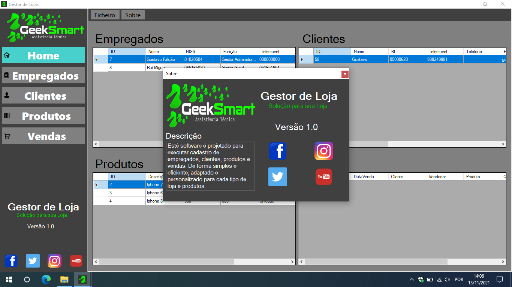
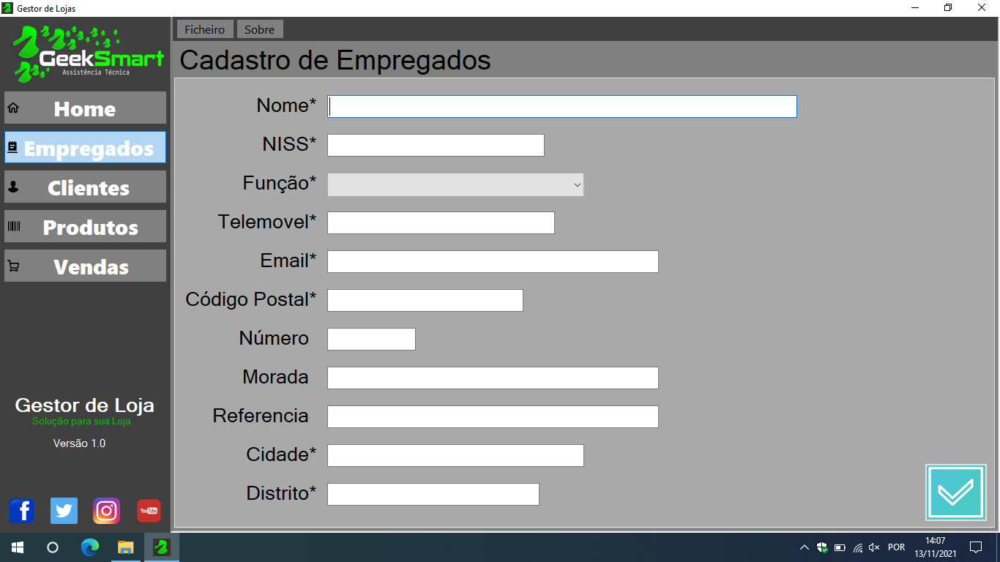
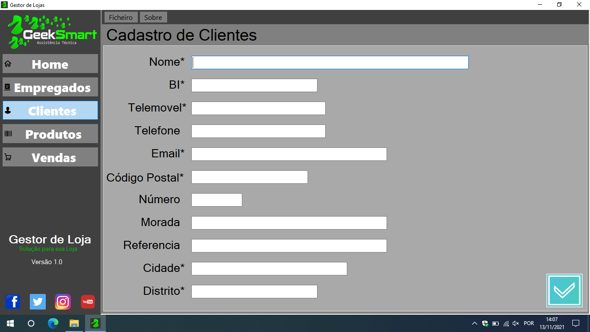
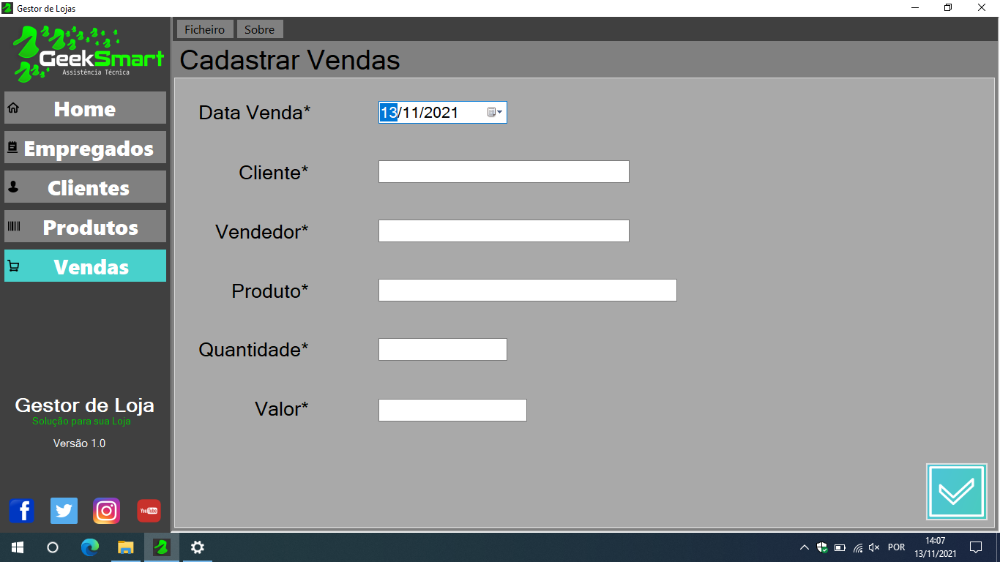

# GeekSmart

Are you starting your business? Or even have some time in the market but don't know how to organize your business data? Geek Smart is the ideal solution for this, with it you can store all this data in a practical and secure way and consult them if necessary. It has a database that can be local or even in the cloud and fully adapted to use the touch screen function. Such a powerful and at the same time practical tool, to use it you don't need any technical training.

## Run

	To run the version of the .exe program, already compiled and found in the folder, you must:
	
	- Rename the folder to "GeekSmart" and copy it to C:\
	- Do not change the name of any folder or file inside.
	- Run GeekSmart.exe

## Screen Shots

