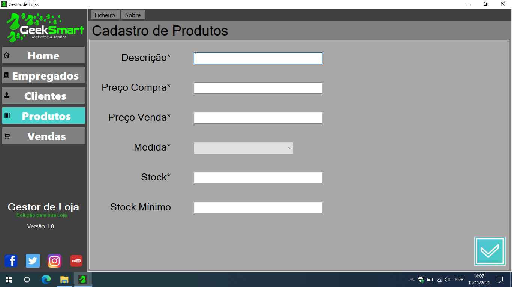

# 📈 GeekSmart

**GeekSmart** is a practical and secure management software designed for entrepreneurs and small businesses looking for an easy way to organize and access their business data. Ideal for businesses of any size, GeekSmart offers both local and cloud-based storage options, fully optimized for touchscreen devices, requiring no technical background to operate.

---

## ✨ Features

- 🗃️ **Efficient Data Management:** Organize business information effortlessly.
- ☁️ **Flexible Storage:** Choose between local or cloud-based database solutions.
- 🖥️ **Touchscreen Optimized:** Fully adapted interface for touchscreen use.
- 🔒 **Secure Data Storage:** Keep your business data safe and readily accessible.

---

## 🚀 How to Run

Follow these steps to run the pre-compiled `.exe` application:

1. **Download and extract** the project folder.
2. **Rename** the main folder to `GeekSmart` and copy it directly to the `C:\` drive.

> ⚠️ **Important:** Do **NOT** rename or modify any subfolders or files inside the main `GeekSmart` folder.

3. **Launch the application:** Double-click `GeekSmart.exe` to start using GeekSmart immediately.

---

## 📸 Screenshots

---

## 🤝 Contributing

Although this project is from my university days, contributions and improvements are always welcome:

1. Fork this repository
2. Create a feature branch (`git checkout -b feature/new-feature`)
3. Commit your changes (`git commit -m 'Add new-feature'`)
4. Push your changes (`git push origin feature/new-feature`)
5. Open a Pull Request

---

## 📄 License

Licensed under the **MIT License**.

---

## 👤 Author

**Gustavo Falcão**  
[GitHub @gustavofalcao1](https://github.com/gustavofalcao1)  
[Project Repository](https://github.com/gustavofalcao1/GeekSmart)

---

